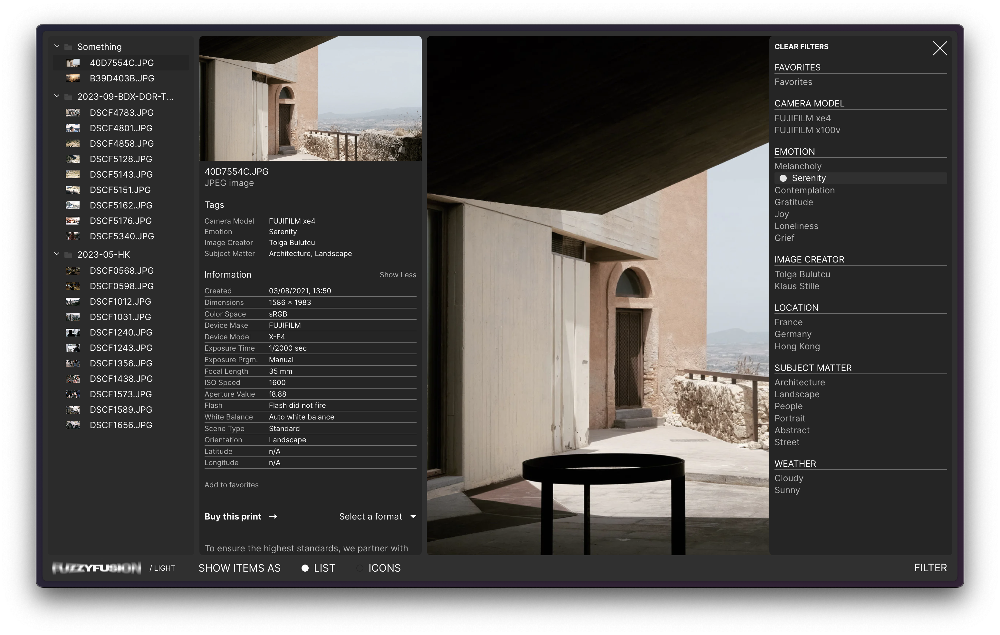
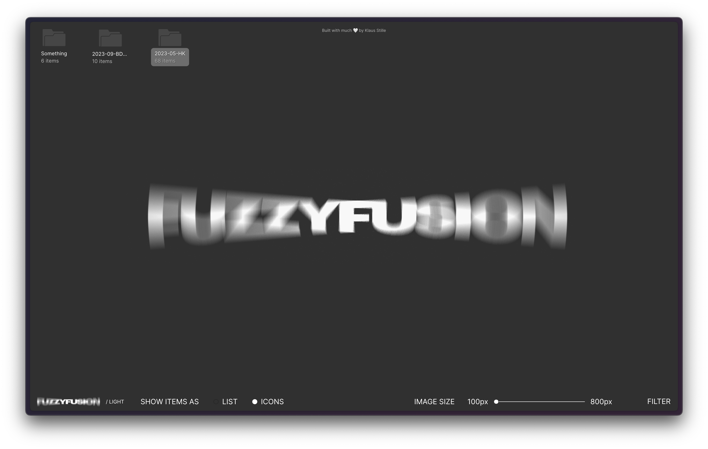
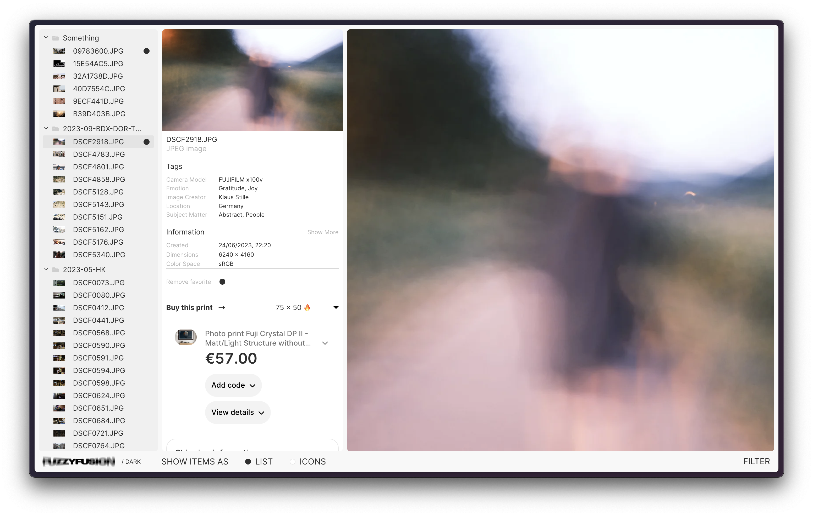

# Fuzzy Fusion

Welcome to Fuzzy Fusion!

Just wrapped up programming the website, and I'm thrilled to introduce FuzzyFusion! ✨ Explore our captivating collection of top-notch prints available now at [www.fuzzyfusion.world](https://www.fuzzyfusion.world). Elevate your space with unique and raw prints.

## Features

-   **Captivating Prints:** Discover a captivating collection of top-notch prints that will elevate your space.
-   **Raw and Authentic:** Each print is raw and authentic, capturing the essence of the moment.
-   **Enhanced Filtering Options:** Easily find prints that match your preferences with our enhanced filtering options.
-   **Image Information from EXIF Data:** Detailed image information available directly from the EXIF data of the image itself, providing valuable insights into each print's capture settings, such as camera model, exposure settings, and much more.
-   **Built with Next.js, Tailwind, and TypeScript:** The website is developed using modern technologies including Next.js, Tailwind CSS, and TypeScript, ensuring performance and maintainability.
-   **Content Delivery with Contentful and GraphQL:** Content is delivered seamlessly using Contentful and GraphQL, enabling efficient management and retrieval of content.
-   **Secure Payment Method:** Purchase prints securely using Stripe, ensuring a smooth and reliable payment process.

## Technologies Used

-   Next.js
-   Tailwind CSS
-   TypeScript
-   Contentful
-   GraphQL
-   Stripe

## Support

If you have any questions or need assistance, please reach out to our support team at [love@fuzzyfusion.world](mailto:love@fuzzyfusion.world).

## Feedback

We value your feedback! Please share your thoughts and suggestions by emailing [love@fuzzyfusion.world](mailto:love@fuzzyfusion.world).
